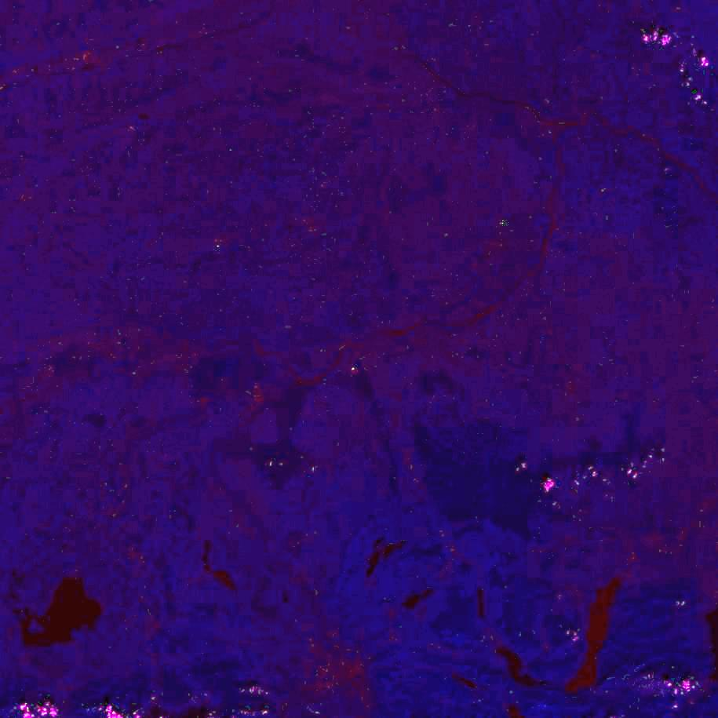

# s2viz
restful api for sentinel-2 image viz

## prerequisites
- linux host with more than 2GB RAM
- docker engine at your side
- git
- Sentinel-2 granules (GTiff) in some folder
- file name pattern has to be e.g. `T33UUP_20180804T100031_B08.tif`

## build
```sh
git clone https://github.com/asamerh4/s2viz.git
cd s2viz
./build.sh
```

## run rest-api
```sh
export data_dir=/my/cool/s2-granule/folder
docker run -d \
  --name s2viz-rest-api \
  -v $data_dir:/s2viz/data \
  -p 8585:8585 \
asamerh4/s2viz:85dbc5b
```

## use rest-api
```sh
curl -X POST -H "Content-Type: application/json" \
  -d '{"utmZone": 33,"latitudeBand": "U","gridSquare": "UP","date": "2018-08-07","channelMap": "vegetation"}' \
http://localhost:8585/api/v1/s2viz/generate-image > test.jpg
```

## api-output
```sh
docker logs -f s2viz-rest-api
```
```sh
2019-03-22 19:35:43 INFO from up42.s2viz.api.impl.AppConfig -

==============
s2viz REST API
==============

2019-03-22 19:35:44 INFO from up42.s2viz.api.Main - Successfully started s2viz REST API
2019-03-22 19:35:47 INFO from up42.s2viz.api.utils.PixelOps - [T33UUP_20180807T101021_B11.tif, T33UUP_20180807T101021_PVI.tif, T33UUP_20180807T101021_B05.tif, T33UUP_20180807T101021_B02.tif, T33UUP_20180807T101021_B10.tif, T33UUP_20180807T101021_B08.tif, T33UUP_20180807T101021_B04.tif, T33UUP_20180807T101021_B06.tif, T33UUP_20180807T101021_B8A.tif, T33UUP_20180807T101021_B01.tif, T33UUP_20180807T101021_B09.tif, T33UUP_20180807T101021_B12.tif, T33UUP_20180807T101021_B03.tif, T33UUP_20180807T101021_B07.tif, T33UUP_20180807T101021_TCI.tif]
2019-03-22 19:35:47 INFO from up42.s2viz.api.utils.PixelOps - VEGETATION --> red: T33UUP_20180807T101021_B05.tif green: T33UUP_20180807T101021_B06.tif blue: T33UUP_20180807T101021_B07.tif
```
## stop API
```sh
docker kill s2viz-rest-api
docker rm $(docker ps -a -q)
```

## visual output
- produced jpegs are not balanced & correctly scaled...
- the following jpegs are edited with irfanView - `AutoAdjust Colors` ;-)

### Infrared
`{"utmZone": 33,"latitudeBand": "U","gridSquare": "UP","date": "2018-08-17","channelMap": "infrared"}`


### Visible
`{"utmZone": 33,"latitudeBand": "U","gridSquare": "UP","date": "2018-08-17","channelMap": "visible"}`


### waterVapor
`{"utmZone": 33,"latitudeBand": "U","gridSquare": "UP","date": "2018-08-17","channelMap": "waterVapor"}`


### vegetation
`{"utmZone": 33,"latitudeBand": "U","gridSquare": "UP","date": "2018-08-17","channelMap": "vegetation"}`

